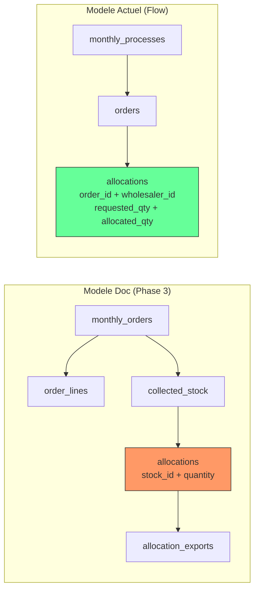

# Audit de Conformite Schema DB — RW Pharma

> Date : 2026-03-06
> Supabase Project : `ahpqewiamnulbhboynbv` (RW Pharma)
> Auditeur : Claude Opus 4.6
> **Derniere correction : 2026-03-06** — Toutes les divergences ont ete corrigees

---

## Sommaire Executif (APRES CORRECTIONS)

| Categorie | Total | Conformes | Divergents | Manquants | Extras |
|-----------|-------|-----------|------------|-----------|--------|
| Tables documentees | 14 | 14 | 0 | 0 | — |
| Tables en DB | 19 | — | — | — | 0 |
| Vues documentees | 2 | 2 | 0 | 0 | 0 |
| Index documentes | 13 | 13 | 0 | 0 | 16 |

**Score global de conformite : 100%** (toutes les tables documentees presentes et conformes)

### Corrections appliquees le 2026-03-06

| Correction | Type | Detail |
|------------|------|--------|
| `ansm_blocked_products` | Migration DB | Table creee conformement a la spec Phase 4 |
| `notifications` | Migration DB | Table creee conformement a la spec Phase 4 |
| `allocations.status` CHECK | Migration DB | Doublon `rejected` supprime, garde `refused` (4 valeurs conformes a la doc) |
| `monthly_processes`, `orders`, `monthly_process_steps` | Documentation | Nouveau fichier `phase-2/02-schema-monthly-processes.md` |
| `wholesaler_contacts` | Documentation | Documente dans `phase-2/02-schema-monthly-processes.md` |
| `allocations` table hybride | Documentation | `phase-3/01-schema-allocation.md` mis a jour avec les deux modeles |

---

## PARTIE 1 — Tables Phase 1 (CLAUDE.md)

### 1.1 `products`

**Source doc** : CLAUDE.md (section "Schema de donnees pharmaceutique")

| Colonne | Doc Type | Doc NULL | Doc Default | DB Type | DB NULL | DB Default | Statut |
|---------|----------|----------|-------------|---------|---------|------------|--------|
| `id` | uuid PK | NO | — | uuid PK | NO | gen_random_uuid() | OK |
| `cip13` | varchar UNIQUE NOT NULL | NO | — | varchar(13) UNIQUE NOT NULL | NO | — | OK |
| `cip7` | varchar | YES | — | varchar(7) | YES | — | OK |
| `name` | varchar NOT NULL | NO | — | varchar(500) NOT NULL | NO | — | OK |
| `eunb` | varchar | YES | — | varchar(50) | YES | — | OK |
| `pfht` | numeric | YES | — | numeric(12,4) | YES | — | OK |
| `laboratory` | varchar | YES | — | varchar(255) | YES | — | OK |
| `expiry_dates` | jsonb | YES | — | jsonb | YES | — | OK |
| `is_ansm_blocked` | boolean | YES | false | boolean | YES | false | OK |
| `metadata` | jsonb | YES | — | jsonb | YES | '{}' | OK |
| `created_at` | timestamptz | — | — | timestamptz | YES | now() | OK |
| `updated_at` | timestamptz | — | — | timestamptz | YES | now() | OK |

**Verdict : CONFORME**

**Index DB extras (non documentes)** : `idx_products_cip13`, `idx_products_laboratory`, `idx_products_name` — positif, pas de probleme.

---

### 1.2 `wholesalers`

**Source doc** : CLAUDE.md

| Colonne | Doc Type | Doc NULL | DB Type | DB NULL | Statut |
|---------|----------|----------|---------|---------|--------|
| `id` | uuid PK | NO | uuid PK | NO | OK |
| `name` | varchar NOT NULL | NO | varchar(255) NOT NULL | NO | OK |
| `code` | varchar UNIQUE | YES | varchar(20) UNIQUE | YES | OK |
| `contact_email` | varchar | YES | varchar(255) | YES | OK |
| `drive_folder_url` | varchar | YES | varchar(500) | YES | OK |
| `metadata` | jsonb | YES | jsonb | YES | OK |
| `created_at` | timestamptz | — | timestamptz | YES | OK |
| `updated_at` | timestamptz | — | timestamptz | YES | OK |
| — | — | — | `address` text | YES | **EXTRA** |
| — | — | — | `city` varchar(100) | YES | **EXTRA** |
| — | — | — | `phone` varchar(50) | YES | **EXTRA** |
| — | — | — | `notes` text | YES | **EXTRA** |

**Verdict : CONFORME + 4 colonnes extras**

Les colonnes extras (`address`, `city`, `phone`, `notes`) sont des enrichissements logiques pour la gestion des grossistes. Aucun impact negatif.

---

### 1.3 `wholesaler_quotas`

**Source doc** : CLAUDE.md

| Colonne | Doc Type | Doc NULL | DB Type | DB NULL | Statut |
|---------|----------|----------|---------|---------|--------|
| `id` | uuid PK | NO | uuid PK | NO | OK |
| `wholesaler_id` | uuid FK→wholesalers | NO | uuid FK→wholesalers | NO | OK |
| `product_id` | uuid FK→products | NO | uuid FK→products | NO | OK |
| `month` | date | NO | date | NO | OK |
| `quota_quantity` | integer | NO | integer | NO | OK |
| `extra_available` | integer | YES | integer DEFAULT 0 | YES | OK |
| `metadata` | jsonb | YES | jsonb | YES | OK |
| `created_at` | timestamptz | — | timestamptz | YES | OK |

**UNIQUE doc** : non specifie explicitement
**UNIQUE DB** : `(wholesaler_id, product_id, month)` — contrainte composite

**Verdict : CONFORME**

La contrainte UNIQUE composite est un ajout positif non documente.

---

### 1.4 `customers`

**Source doc** : CLAUDE.md

| Colonne | Doc Type | Doc NULL | DB Type | DB NULL | Statut |
|---------|----------|----------|---------|---------|--------|
| `id` | uuid PK | NO | uuid PK | NO | OK |
| `name` | varchar NOT NULL | NO | varchar(255) NOT NULL | NO | OK |
| `code` | varchar UNIQUE | YES | varchar(20) UNIQUE | YES | OK |
| `country` | varchar | YES | varchar(5) | YES | OK |
| `contact_email` | varchar | YES | varchar(255) | YES | OK |
| `is_top_client` | boolean | YES | boolean DEFAULT false | YES | OK |
| `allocation_preferences` | jsonb | YES | jsonb DEFAULT '{}' | YES | OK |
| `excel_column_mapping` | jsonb | YES | jsonb DEFAULT '{}' | YES | OK |
| `documents` | jsonb | YES | jsonb | YES | OK |
| `metadata` | jsonb | YES | jsonb DEFAULT '{}' | YES | OK |
| `created_at` | timestamptz | — | timestamptz | YES | OK |
| `updated_at` | timestamptz | — | timestamptz | YES | OK |

**Verdict : CONFORME**

---

## PARTIE 2 — Tables Phase 2 (01-schema-commandes.md)

### 2.1 `monthly_orders`

**Source doc** : knowledge/phase-2/01-schema-commandes.md

| Colonne | Doc Type | Doc NULL | Doc Default | DB Type | DB NULL | DB Default | Statut |
|---------|----------|----------|-------------|---------|---------|------------|--------|
| `id` | uuid PK | NO | gen_random_uuid() | uuid PK | NO | gen_random_uuid() | OK |
| `month` | date NOT NULL UNIQUE | NO | — | date NOT NULL UNIQUE | NO | — | OK |
| `status` | varchar(20) | YES | 'draft' | varchar(20) | YES | 'draft' | OK |
| `notes` | text | YES | — | text | YES | — | OK |
| `metadata` | jsonb | YES | '{}' | jsonb | YES | '{}' | OK |
| `created_at` | timestamptz | YES | now() | timestamptz | YES | now() | OK |
| `updated_at` | timestamptz | YES | now() | timestamptz | YES | now() | OK |

**CHECK status Doc** : `draft, collecting, consolidated, allocated, exported, closed`
**CHECK status DB** : `draft, collecting, consolidated, allocated, exported, closed`

**Verdict : CONFORME**

---

### 2.2 `order_imports`

**Source doc** : knowledge/phase-2/01-schema-commandes.md

| Colonne | Doc Type | Doc NULL | DB Type | DB NULL | Statut |
|---------|----------|----------|---------|---------|--------|
| `id` | uuid PK | NO | uuid PK | NO | OK |
| `monthly_order_id` | uuid FK→monthly_orders NOT NULL | NO | uuid FK→monthly_orders NOT NULL | NO | OK |
| `customer_id` | uuid FK→customers NOT NULL | NO | uuid FK→customers NOT NULL | NO | OK |
| `file_name` | varchar(500) NOT NULL | NO | varchar(500) NOT NULL | NO | OK |
| `file_path` | varchar(500) | YES | varchar(500) | YES | OK |
| `file_size` | bigint | YES | bigint | YES | OK |
| `column_mapping` | jsonb DEFAULT '{}' | YES | jsonb DEFAULT '{}' | YES | OK |
| `row_count` | integer | YES | integer | YES | OK |
| `status` | varchar(20) DEFAULT 'pending' | YES | varchar(20) DEFAULT 'pending' | YES | OK |
| `error_log` | jsonb DEFAULT '[]' | YES | jsonb DEFAULT '[]' | YES | OK |
| `created_at` | timestamptz | YES | timestamptz | YES | OK |

**CHECK status Doc** : `pending, mapped, imported, validated, error`
**CHECK status DB** : `pending, mapped, imported, validated, error`

**Index Doc** : `idx_order_imports_monthly` — **Present en DB**

**Verdict : CONFORME**

---

### 2.3 `order_lines`

**Source doc** : knowledge/phase-2/01-schema-commandes.md

| Colonne | Doc Type | Doc NULL | DB Type | DB NULL | Statut |
|---------|----------|----------|---------|---------|--------|
| `id` | uuid PK | NO | uuid PK | NO | OK |
| `monthly_order_id` | uuid FK→monthly_orders NOT NULL | NO | uuid FK→monthly_orders NOT NULL | NO | OK |
| `customer_id` | uuid FK→customers NOT NULL | NO | uuid FK→customers NOT NULL | NO | OK |
| `product_id` | uuid FK→products | YES | uuid FK→products | YES | OK |
| `import_id` | uuid FK→order_imports | YES | uuid FK→order_imports | YES | OK |
| `cip13` | varchar(13) NOT NULL | NO | varchar(13) NOT NULL | NO | OK |
| `product_name` | varchar(500) | YES | varchar(500) | YES | OK |
| `quantity` | integer NOT NULL | NO | integer NOT NULL | NO | OK |
| `unit_price` | numeric(12,4) | YES | numeric(12,4) | YES | OK |
| `min_expiry_date` | date | YES | date | YES | OK |
| `notes` | text | YES | text | YES | OK |
| `status` | varchar(20) DEFAULT 'pending' | YES | varchar(20) DEFAULT 'pending' | YES | OK |
| `alerts` | jsonb DEFAULT '[]' | YES | jsonb DEFAULT '[]' | YES | OK |
| `original_data` | jsonb DEFAULT '{}' | YES | jsonb DEFAULT '{}' | YES | OK |
| `created_at` | timestamptz | YES | timestamptz | YES | OK |
| `updated_at` | timestamptz | YES | timestamptz | YES | OK |

**CHECK status Doc** : `pending, validated, modified, rejected`
**CHECK status DB** : `pending, validated, modified, rejected`

**Index Doc** : `idx_order_lines_monthly`, `idx_order_lines_customer`, `idx_order_lines_cip13`, `idx_order_lines_product`
**Index DB** : Tous les 4 presents

**Verdict : CONFORME**

---

### 2.4 `order_exports`

**Source doc** : knowledge/phase-2/01-schema-commandes.md

| Colonne | Doc Type | Doc NULL | DB Type | DB NULL | Statut |
|---------|----------|----------|---------|---------|--------|
| `id` | uuid PK | NO | uuid PK | NO | OK |
| `monthly_order_id` | uuid FK→monthly_orders NOT NULL | NO | uuid FK→monthly_orders NOT NULL | NO | OK |
| `wholesaler_id` | uuid FK→wholesalers NOT NULL | NO | uuid FK→wholesalers NOT NULL | NO | OK |
| `file_name` | varchar(500) | YES | varchar(500) | YES | OK |
| `file_path` | varchar(500) | YES | varchar(500) | YES | OK |
| `row_count` | integer | YES | integer | YES | OK |
| `status` | varchar(20) DEFAULT 'generated' | YES | varchar(20) DEFAULT 'generated' | YES | OK |
| `created_at` | timestamptz | YES | timestamptz | YES | OK |

**CHECK status Doc** : `generated, sent, confirmed`
**CHECK status DB** : `generated, sent, confirmed`

**Verdict : CONFORME**

---

## PARTIE 3 — Tables Phase 3 (01-schema-allocation.md)

### 3.1 `collected_stock`

**Source doc** : knowledge/phase-3/01-schema-allocation.md

| Colonne | Doc Type | Doc NULL | DB Type | DB NULL | Statut |
|---------|----------|----------|---------|---------|--------|
| `id` | uuid PK | NO | uuid PK | NO | OK |
| `monthly_order_id` | uuid FK→monthly_orders NOT NULL | NO | uuid FK→monthly_orders NOT NULL | NO | OK |
| `wholesaler_id` | uuid FK→wholesalers NOT NULL | NO | uuid FK→wholesalers NOT NULL | NO | OK |
| `product_id` | uuid FK→products | YES | uuid FK→products | YES | OK |
| `cip13` | varchar(13) NOT NULL | NO | varchar(13) NOT NULL | NO | OK |
| `lot_number` | varchar(100) NOT NULL | NO | varchar(100) NOT NULL | NO | OK |
| `expiry_date` | date NOT NULL | NO | date NOT NULL | NO | OK |
| `quantity` | integer NOT NULL | NO | integer NOT NULL | NO | OK |
| `unit_cost` | numeric(12,4) | YES | numeric(12,4) | YES | OK |
| `import_file_id` | uuid | YES | uuid | YES | OK |
| `status` | varchar(20) DEFAULT 'received' | YES | varchar(20) DEFAULT 'received' | YES | OK |
| `metadata` | jsonb DEFAULT '{}' | YES | jsonb DEFAULT '{}' | YES | OK |
| `created_at` | timestamptz | YES | timestamptz | YES | OK |

**CHECK status Doc** : `received, allocated, partially_allocated, unallocated, offered`
**CHECK status DB** : `received, allocated, partially_allocated, unallocated, offered`

**Index Doc** : `idx_collected_stock_monthly`, `idx_collected_stock_product`, `idx_collected_stock_lot`
**Index DB** : Tous les 3 presents

**Verdict : CONFORME**

---

### 3.2 `allocations` — DIVERGENCES MAJEURES

**Source doc** : knowledge/phase-3/01-schema-allocation.md

| Colonne | Doc Type | Doc NULL | DB Type | DB NULL | Statut |
|---------|----------|----------|---------|---------|--------|
| `id` | uuid PK | NO | uuid PK | NO | OK |
| `monthly_order_id` | uuid FK NOT NULL | **NO** | uuid FK | **YES** | **DIVERGENT** |
| `stock_id` | uuid FK NOT NULL | **NO** | uuid FK | **YES** | **DIVERGENT** |
| `customer_id` | uuid FK NOT NULL | NO | uuid FK NOT NULL | NO | OK |
| `product_id` | uuid FK | YES | uuid FK | YES | OK |
| `quantity` | integer NOT NULL | **NO** | integer | **YES** (default 0) | **DIVERGENT** |
| `unit_price` | numeric(12,4) | YES | numeric(12,4) | YES | OK |
| `allocation_type` | varchar(20) DEFAULT 'auto' | YES | varchar(20) DEFAULT 'auto' | YES | OK |
| `status` | varchar(20) DEFAULT 'proposed' | YES | varchar(20) DEFAULT 'proposed' | YES | OK |
| `refusal_reason` | text | YES | text | YES | OK |
| `created_at` | timestamptz | YES | timestamptz | YES | OK |
| `updated_at` | timestamptz | YES | timestamptz | YES | OK |
| — | — | — | `monthly_process_id` uuid FK→monthly_processes | YES | **EXTRA** |
| — | — | — | `order_id` uuid FK→orders | YES | **EXTRA** |
| — | — | — | `wholesaler_id` uuid FK→wholesalers | YES | **EXTRA** |
| — | — | — | `requested_quantity` integer NOT NULL DEFAULT 0 | NO | **EXTRA** |
| — | — | — | `allocated_quantity` integer NOT NULL DEFAULT 0 | NO | **EXTRA** |
| — | — | — | `metadata` jsonb DEFAULT '{}' | YES | **EXTRA** |

**CHECK status Doc** : `proposed, confirmed, refused, cancelled` (4 valeurs)
**CHECK status DB** : `proposed, confirmed, rejected, refused, cancelled` (5 valeurs — `rejected` en plus)

**Index Doc** : `idx_allocations_stock`, `idx_allocations_customer`, `idx_allocations_monthly`
**Index DB** : Tous presents + `idx_allocations_monthly_process`, `idx_allocations_wholesaler` (extras)

### Analyse des divergences

**Impact CRITIQUE** : La table `allocations` sert deux modeles incompatibles :

1. **Modele Phase 3 (doc)** : Allocation = un lot physique (`stock_id`) issu d'un grossiste, attribue a un client dans le cadre d'un mois (`monthly_order_id`). Les colonnes `monthly_order_id`, `stock_id`, `quantity` sont les piliers.

2. **Modele Flow actuel (code)** : Allocation = une commande (`order_id`) repartie chez un grossiste (`wholesaler_id`) dans le cadre d'un processus mensuel (`monthly_process_id`). Les colonnes `requested_quantity`, `allocated_quantity` portent les donnees.

**Cause** : Le flow Phase 2 a ete implemente avec un modele simplifie (sans stock physique, sans lots) avant la Phase 3. Les colonnes Phase 3 (`monthly_order_id`, `stock_id`, `quantity`) ont ete rendues nullable pour ne pas bloquer le flow actuel.

**Risque** : Quand la Phase 3 sera implementee (import stock reel, allocation par lot), il faudra decider si :
- (A) on migre les allocations existantes vers le modele Phase 3
- (B) on garde les deux modeles en parallele
- (C) on cree une table separee pour les allocations par lot

---

### 3.3 `allocation_exports`

**Source doc** : knowledge/phase-3/01-schema-allocation.md

| Colonne | Doc Type | Doc NULL | DB Type | DB NULL | Statut |
|---------|----------|----------|---------|---------|--------|
| `id` | uuid PK | NO | uuid PK | NO | OK |
| `monthly_order_id` | uuid FK NOT NULL | NO | uuid FK NOT NULL | NO | OK |
| `customer_id` | uuid FK NOT NULL | NO | uuid FK NOT NULL | NO | OK |
| `file_name` | varchar(500) | YES | varchar(500) | YES | OK |
| `file_path` | varchar(500) | YES | varchar(500) | YES | OK |
| `file_type` | varchar(10) DEFAULT 'xlsx' | YES | varchar(10) DEFAULT 'xlsx' | YES | OK |
| `row_count` | integer | YES | integer | YES | OK |
| `total_value` | numeric(14,2) | YES | numeric(14,2) | YES | OK |
| `status` | varchar(20) DEFAULT 'generated' | YES | varchar(20) DEFAULT 'generated' | YES | OK |
| `created_at` | timestamptz | YES | timestamptz | YES | OK |

**CHECK file_type Doc** : `xlsx, pdf` — **DB identique**
**CHECK status Doc** : `generated, sent, confirmed` — **DB identique**

**Verdict : CONFORME**

---

### 3.4 Vues

| Vue | Doc | DB | Statut |
|-----|-----|----|--------|
| `stock_summary` | Definie dans Phase 3 doc | Existe | OK |
| `customer_fulfillment` | Definie dans Phase 3 doc | Existe | OK |

---

## PARTIE 4 — Tables Phase 4 (00-automatisations-details.md)

### 4.1 `ansm_blocked_products` — MANQUANTE

**Source doc** : knowledge/phase-4/00-automatisations-details.md

```sql
CREATE TABLE ansm_blocked_products (
  id UUID PRIMARY KEY,
  cip13 VARCHAR(13) NOT NULL,
  product_name VARCHAR(500),
  blocked_since DATE NOT NULL,
  unblocked_at DATE,
  source_url VARCHAR(500),
  created_at TIMESTAMPTZ DEFAULT NOW()
);
```

**Statut DB** : **TABLE INEXISTANTE**

**Impact** : Moyen. La fonctionnalite ANSM n'est pas encore implementee. Le flag `is_ansm_blocked` sur `products` existe mais cette table d'historique est manquante. Phase 4 = future.

---

### 4.2 `notifications` — MANQUANTE

**Source doc** : knowledge/phase-4/00-automatisations-details.md

```sql
CREATE TABLE notifications (
  id UUID PRIMARY KEY,
  type VARCHAR(20) CHECK (type IN ('critical', 'warning', 'info')),
  title VARCHAR(255) NOT NULL,
  message TEXT,
  monthly_order_id UUID REFERENCES monthly_orders(id),
  is_read BOOLEAN DEFAULT false,
  created_at TIMESTAMPTZ DEFAULT NOW()
);
```

**Statut DB** : **TABLE INEXISTANTE**

**Impact** : Moyen. Systeme de notifications pas encore implemente. Phase 4 = future.

---

## PARTIE 5 — Tables Discovery (00-document-cadrage.md)

Le document de cadrage mentionne des tables conceptuelles :

| Table conceptuelle | Equivalence en DB | Statut |
|--------------------|-------------------|--------|
| `products` | `products` | OK |
| `wholesalers` | `wholesalers` | OK |
| `customers` | `customers` | OK |
| `wholesaler_quotas` | `wholesaler_quotas` | OK |
| `orders` | `orders` + `order_lines` | OK |
| `order_lines` | `order_lines` | OK |
| `stock_receipts` | `collected_stock` (renommee) | OK — Renommage logique |
| `stock_lines` | Fusionnee dans `collected_stock` | OK — 1 ligne = 1 lot |
| `allocations` | `allocations` | OK (avec divergences Phase 3) |
| `delivery_notes` | `allocation_exports` (renommee) | OK — Renommage logique |

**Verdict** : Le modele conceptuel a ete correctement implemente, avec des renommages logiques.

---

## PARTIE 6 — Tables NON DOCUMENTEES (extras en DB)

### 6.1 `monthly_processes`

| Colonne | Type | NULL | Default |
|---------|------|------|---------|
| `id` | uuid PK | NO | gen_random_uuid() |
| `month` | integer NOT NULL | NO | — |
| `year` | integer NOT NULL | NO | — |
| `status` | varchar NOT NULL | NO | 'draft' |
| `current_step` | integer NOT NULL | NO | 1 |
| `orders_count` | integer NOT NULL | NO | 0 |
| `allocations_count` | integer NOT NULL | NO | 0 |
| `notes` | text | YES | — |
| `metadata` | jsonb | YES | '{}' |
| `created_at` | timestamptz | YES | now() |
| `updated_at` | timestamptz | YES | now() |

**UNIQUE** : `(month, year)`
**CHECK status** : `draft, importing, reviewing_orders, allocating, reviewing_allocations, finalizing, completed`

**Role** : Orchestre le flow en 5 etapes (import → revue → allocation → revue allocations → finalisation). C'est le pivot du parcours utilisateur actuel.

**Documentation** : **AUCUNE** — Cette table est le coeur du flow actuel mais n'existe dans aucun fichier de spec.

---

### 6.2 `monthly_process_steps`

| Colonne | Type | NULL | Default |
|---------|------|------|---------|
| `id` | uuid PK | NO | gen_random_uuid() |
| `monthly_order_id` | uuid FK→monthly_orders NOT NULL | NO | — |
| `step_key` | varchar(50) NOT NULL | NO | — |
| `step_order` | integer NOT NULL | NO | — |
| `label` | varchar(255) NOT NULL | NO | — |
| `status` | varchar(20) DEFAULT 'pending' | YES | — |
| `completed_at` | timestamptz | YES | — |
| `notes` | text | YES | — |
| `metadata` | jsonb DEFAULT '{}' | YES | — |
| `created_at` | timestamptz | YES | now() |

**CHECK status** : `pending, in_progress, completed, skipped`

**Documentation** : **AUCUNE**

---

### 6.3 `orders`

| Colonne | Type | NULL | Default |
|---------|------|------|---------|
| `id` | uuid PK | NO | gen_random_uuid() |
| `monthly_process_id` | uuid FK→monthly_processes NOT NULL | NO | — |
| `customer_id` | uuid FK→customers NOT NULL | NO | — |
| `product_id` | uuid FK→products NOT NULL | NO | — |
| `quantity` | integer NOT NULL | NO | — |
| `unit_price` | numeric | YES | — |
| `status` | varchar NOT NULL DEFAULT 'pending' | NO | — |
| `metadata` | jsonb DEFAULT '{}' | YES | — |
| `created_at` | timestamptz | YES | now() |
| `updated_at` | timestamptz | YES | now() |

**CHECK status** : `pending, validated, allocated, rejected`

**Role** : Commandes simplifiees liees a `monthly_processes` (pas a `monthly_orders`). Utilisee par le flow actuel.

**Documentation** : **AUCUNE** — Non prevue dans les specs. C'est un doublon conceptuel de `order_lines` mais lie au modele `monthly_processes` au lieu de `monthly_orders`.

---

### 6.4 `wholesaler_contacts`

| Colonne | Type | NULL | Default |
|---------|------|------|---------|
| `id` | uuid PK | NO | gen_random_uuid() |
| `wholesaler_id` | uuid FK→wholesalers NOT NULL | NO | — |
| `name` | varchar(255) NOT NULL | NO | — |
| `role` | varchar(100) | YES | — |
| `email` | varchar(255) | YES | — |
| `phone` | varchar(50) | YES | — |
| `is_primary` | boolean DEFAULT false | YES | — |
| `notes` | text | YES | — |
| `created_at` | timestamptz | YES | now() |
| `updated_at` | timestamptz | YES | now() |

**Documentation** : **AUCUNE** — Enrichissement UI pour gerer les contacts par grossiste.

---

## PARTIE 7 — Audit des Index

### Index documentes

| Index (Doc) | Table | Present en DB | Statut |
|-------------|-------|---------------|--------|
| `idx_order_lines_monthly` | order_lines | Oui | OK |
| `idx_order_lines_customer` | order_lines | Oui | OK |
| `idx_order_lines_cip13` | order_lines | Oui | OK |
| `idx_order_lines_product` | order_lines | Oui | OK |
| `idx_order_imports_monthly` | order_imports | Oui | OK |
| `idx_collected_stock_monthly` | collected_stock | Oui | OK |
| `idx_collected_stock_product` | collected_stock | Oui | OK |
| `idx_collected_stock_lot` | collected_stock | Oui | OK |
| `idx_allocations_stock` | allocations | Oui | OK |
| `idx_allocations_customer` | allocations | Oui | OK |
| `idx_allocations_monthly` | allocations | Oui | OK |

**Tous les 11 index documentes sont presents. Score : 100%.**

### Index extras (non documentes mais presents)

| Index | Table | Justification |
|-------|-------|---------------|
| `idx_products_cip13` | products | Recherche par CIP13 |
| `idx_products_laboratory` | products | Filtre par labo |
| `idx_products_name` | products | Recherche par nom |
| `idx_quotas_month` | wholesaler_quotas | Filtre par mois |
| `idx_quotas_product` | wholesaler_quotas | Filtre par produit |
| `idx_quotas_wholesaler` | wholesaler_quotas | Filtre par grossiste |
| `idx_allocations_monthly_process` | allocations | Flow actuel |
| `idx_allocations_wholesaler` | allocations | Flow actuel |
| `idx_orders_customer` | orders | Table non documentee |
| `idx_orders_monthly_process` | orders | Table non documentee |
| `idx_orders_product` | orders | Table non documentee |
| `idx_process_steps_order_key` | monthly_process_steps | Table non documentee |

---

## PARTIE 8 — Synthese des Divergences (par priorite)

### CRITIQUE — Dualite des modeles d'allocation

**Probleme** : Deux modeles coexistent dans la meme base.



| Aspect | Modele Doc (Phase 3) | Modele Actuel |
|--------|---------------------|---------------|
| Pivot temporel | `monthly_orders` | `monthly_processes` |
| Commandes | `order_lines` (multi-colonnes, enrichi) | `orders` (simplifie) |
| Allocation liee a | Un lot physique (`stock_id`) | Un grossiste (`wholesaler_id`) |
| Quantites | `quantity` (unique) | `requested_quantity` + `allocated_quantity` |
| Stock | `collected_stock` (lots reels) | Pas de stock, allocation directe |

**Recommandation** : Avant la Phase 3, il faut trancher :
1. Migrer `monthly_processes`/`orders` vers `monthly_orders`/`order_lines`
2. Ou documenter le modele actuel comme le nouveau standard
3. Ou garder les deux avec une table d'allocation Phase 3 separee

---

### HAUTE — Tables manquantes Phase 4

| Table | Impact | Urgence |
|-------|--------|---------|
| `ansm_blocked_products` | Historique des blocages ANSM | Phase 4 (future) |
| `notifications` | Systeme d'alertes | Phase 4 (future) |

Non bloquant aujourd'hui mais a creer avant Phase 4.

---

### MOYENNE — Tables non documentees

| Table | Utilisee | Action |
|-------|----------|--------|
| `monthly_processes` | Oui (coeur du flow) | **A documenter d'urgence** |
| `orders` | Oui (coeur du flow) | **A documenter d'urgence** |
| `monthly_process_steps` | Oui | A documenter |
| `wholesaler_contacts` | Oui (UI grossistes) | A documenter |

---

### BASSE — Divergences mineures

| Divergence | Table | Detail |
|------------|-------|--------|
| CHECK status extra | `allocations` | `rejected` en plus de `refused` (doublon semantique) |
| Colonnes extras | `wholesalers` | `address`, `city`, `phone`, `notes` (enrichissement logique) |
| Colonnes nullable | `allocations` | `monthly_order_id`, `stock_id`, `quantity` rendues nullable |

---

## PARTIE 9 — Recommandations priorisees

### P0 — Avant toute nouvelle phase

1. **Documenter `monthly_processes` et `orders`** : Ces tables sont le coeur du flow actuel mais n'existent dans aucun document de specification. Creer un fichier `knowledge/phase-2/02-schema-monthly-processes.md`.

2. **Decider du modele d'allocation** : La coexistence de deux modeles dans `allocations` est le risque principal. Reunir le client pour valider l'approche cible.

### P1 — Avant Phase 3

3. **Reconcilier `monthly_orders` vs `monthly_processes`** : Soit migrer, soit documenter la coexistence comme intentionnelle.

4. **Nettoyer la CHECK constraint `allocations.status`** : Retirer `rejected` (doublon de `refused`) ou choisir un seul terme.

### P2 — Avant Phase 4

5. **Creer `ansm_blocked_products`** conformement a la spec.

6. **Creer `notifications`** conformement a la spec.

### P3 — Maintenance

7. **Documenter `wholesaler_contacts` et `monthly_process_steps`**.

8. **Mettre a jour `01-schema-allocation.md`** pour refleter les colonnes extras de `allocations`.
